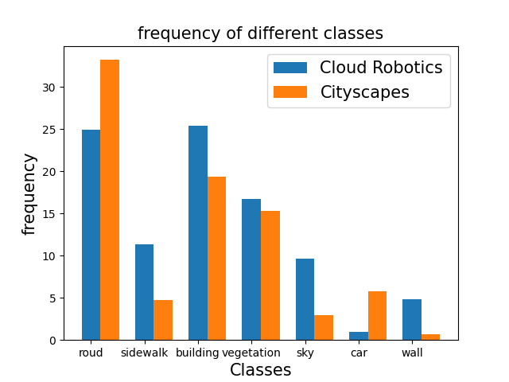
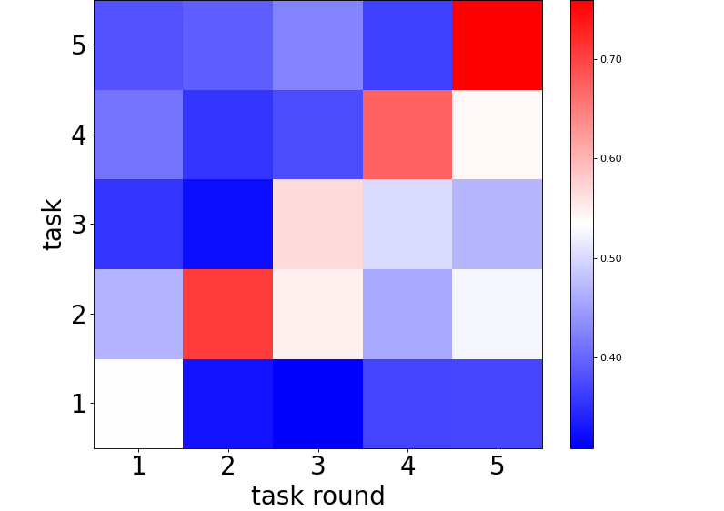

# 新数据集开源！Kubeedge-Ianvs发布首个云机器人语义分割终身学习数据集

作者：XXX

在边缘计算的浪潮中，AI是边缘云乃至分布式云中最重要的应用。随着边缘设备的广泛使用和性能提升，将人工智能相关的部分任务部署到边缘设备已经成为必然趋势。华为于2022年开源并捐献到CNCF的KubeEdge-Ianvs子项目，作为业界首个分布式协同AI基准测试平台为算法及服务开发者提供全面开发套件支持，以研发、衡量和优化分布式协同AI系统。

KubeEdge SIG AI 中来自XX的成员XXX，在KubeEdge-Ianvs上共同发布了云机器人终身学习语义分割数据集Cloud-Robotics。Ianvs 很荣幸成为首个发布此数据集的站点，工作组也同步将Cloud-Robotics公共数据集托管在 Kaggle和云服务上方便开发者下载。

**KubeEdge-Ianvs项目地址：**

https://github.com/kubeedge/ianvs

**Cloud-Robotics数据集@Ianvs：**

https://github.com/hsj576/ianvs/tree/cloud-robotics/examples/robot/lifelong_learning_bench

**Cloud-Robotics数据集网站：**

https://hsj576.github.io/index.html

**数据集引用：**

```
@online{Cloud-Robotics,
        title={Cloud Robotics: a Robotic Semantic Segmentation Benchmark for Lifelong Learning},
        url={https://hsj576.github.io/}
    }             
```

## 1. Cloud-Robotics数据集介绍

### 1.1 什么是Cloud-Robotics数据集

Cloud-Robotics是在华为深圳工业园区由智能机械狗采集的语义分割数据集。该数据集共包含2500张精心标注的语义分割图片，下面展示了数据集中的部分图片。


语义分割任务是将图像中的每个像素分配一个语义标签的任务。它可以被视为像素级别的分类任务，其中每个像素被认为是其周围环境的一部分，并且需要根据其语义类别进行分类。与传统的图像分类任务不同，语义分割需要对图像中的每个像素进行分类，因此需要更加精细和准确的模型和算法。语义分割在计算机视觉中有着广泛的应用，如自动驾驶、医学图像分析、地图制作等。Cloud-Robotics数据集中出现的物体包含7大类，共30小类。其类别分布如下：

|    Group     |                           Classes                            |
| :----------: | :----------------------------------------------------------: |
|     flat     |               road · sidewalk · ramp · runway                |
|    human     |                        person · rider                        |
|   vehicle    |       car · truck · bus · train · motorcycle · bicycle       |
| construction |  building · wall · fence · stair · curb · flowerbed · door   |
|    object    | pole · traffic sign · traffic light · CCTV camera · Manhole · hydrant · belt · dustbin |
|    nature    |                     vegetation · terrain                     |
|     sky      |                             sky                              |

Cloud-Robotics数据集主要在华为深圳工业园区的前庭和花园中采集，数据集按照采集的地点分为了front和garden两部分，如下图所示：


数据集中所有的图片都经过了完善的标注，可以直接用于训练语义分割模型。

### 1.2 Cloud-Robotics数据集与其他数据集的比较

语义分割领域目前已经有了不少相关开源的数据集，比如CVPR2016中发表的Cityscapes数据集。相信大家肯定会很好奇我们发布的Cloud-Robotics数据集和他们有什么异同。下表中详细比较了Cloud-Robotics和Cityscapes的异同：

|                  | Cloud-Robotics               | Cityscapes                   |
| ---------------- | ---------------------------- | ---------------------------- |
| 处理的任务       | 语义分割任务                 | 语义分割任务                 |
| 采集方式         | 机械狗采集                   | 汽车行车记录仪采集           |
| 图片数量         | 2500张标注图片               | 5000张标注图片               |
| 物体类别         | 30类（更多园区内出现的目标） | 30类（更多公路上出现的目标） |
| 图片采集地点范围 | 深圳工业园区内               | 50个欧洲的城市               |
| 图片采集时间范围 | 一天内                       | 数个月                       |

不难看出，Cityscapes属于大而广的数据集，采集图片来自50个城市，采集时间跨度从春天到秋天。而Cloud-Robotics属于小而精的数据集，采集图片全部来自深圳工业园区，同时采集时间也只有一天。所以虽然Cloud-Robotics相比Cityscapes在图片数量上要更少一些，但是要更加聚焦在单一地点中的语义分割任务。同时Cityscapes数据集中出现的物体类别更偏向公路上会出现的物体，如汽车、行人等等，而Cloud-Robotics数据集中出现的物体类别更偏向园区中会出现的物体，如建筑物、墙等等。两个数据集中主要出现的物体类别频率差异如下图所示：



此外在Cloud-Robotics数据集中还存在井盖、摄像头、门和扶手等Cityscapes数据集中不存在的类别。相比Cityscapes数据集，由机械狗采集的Cloud-Robotics数据集更贴合实际机器人场景的需求。

### 1.3 为什么我们需要Cloud-Robotics数据集

（1）丰富语义分割任务开源数据集

Cloud-Robotics为语义分割任务提供了一个新的开源数据集。相比其他数据集，Cloud-Robotics是首个在真实世界场景中由机械狗实地收集的数据集。对于语义分割任务来说，Cloud-Robotics是其在机器人领域应用的一个新的benchmark。

（2）首个终身学习领域语义分割任务真实世界数据集

由于现实世界中普遍存在数据漂移（data drift）等问题，对于模型来说具备终身学习能力变得越来越重要。然而目前终身学习领域相关研究要么是在SplitMNIST这样的toy dataset上进行实验，要么是在Cityscapes这样并不适合终身学习的数据集上进行实验。对于前者，虽然SplitMNIST等数据集中确实人为构造出了数据分布随任务轮数变化这一数据漂移现象，但是由于其来源并非真实数据集，所测试的终身学习算法在现实世界应用时的准确率恐怕要大打折扣。对于后者，Cityscapes是一个很好的语义分割任务的数据集，但是它并不是很适用于检测终身学习算法的性能。以一个5轮任务的终身学习为例，下图分别是对数据集按照时间顺序划分成5轮任务后不同任务类别频率的变化。


可以看出Cloud-Robotics数据集上存在明显的数据漂移现象，而Cityscapes的数据漂移现象则不是很明显。因此，相比SplitMNIST等目前典型的终身学习数据集，Cloud-Robotics数据集是真实世界采集的数据集，其验证终身学习算法的效果更有说服力；相比Cityscapes数据集，Cloud-Robotics数据集中存在真实的数据漂移现象，更适合测试终身学习算法的性能。

## 2. 基于Cloud-Robotics的终身学习基准测试案例

基于Cloud-Robotics数据集，我们同步公布基于Ianvs的边云协同终身学习使用案例。该案例中使用RAL2020论文 “Real-Time Fusion Network for RGB-D Semantic Segmentation Incorporating Unexpected Obstacle Detection for Road-Driving Images”中提出的RFNet作为基模型，进行终身学习测试。以一个5轮任务的终身学习为例，其结果如下：



第 [1(task round), 3(task)] 格代表模型在第一轮任务上训练完之后在第三轮任务上测试的结果，从测试结果上不难看出模型在终身学习训练过程中出现了爆炸性遗忘问题，即在学习到了新的任务的信息后忘记了旧任务的信息。

**基准测试案例文档：**

https://github.com/hsj576/ianvs-lifelong-learning-tutorial/blob/main/tutorial/tutorial.md

## 3. 遗留工作

（1）更丰富的语义分割基模型

目前Cloud-Robotics数据集只在RFNet上进行了测试，未来希望有更多的语义分割模型在Cloud-Robotics数据集上进行测试。

（2）更丰富的终身学习算法

目前在Cloud-Robotics数据集上进行的终身学习测试结果中出现了明显的爆炸性遗忘问题，这也给了终身学习领域带来了新的挑战。目前，终身学习算法在Cloud-Robotics数据集上的性能有着很大的提升空间，未来希望有更多的终身学习算法在Cloud-Robotics数据集上进行测试。