# 从零开始的Ianvs终身学习

## 前言

本文提供一个对Ianvs终身学习新特性更新后使用的教程。本教程面向对Ianvs零基础的同学，教程内容也包括一些笔者使用Ianvs终身学习的心得和踩坑的地方，希望能帮助大家快速上手Ianvs。

## Ianvs安装

Ianvs安装的方式在[官方教程](https://ianvs.readthedocs.io/en/latest/guides/quick-start.html)里有详细描述，但是因为本教程面向零基础的同学，笔者在这里也给出一个安装Ianvs的案例，如果对此环节较为熟悉的同学可以跳过。

### 环境配置

Ianvs官方文档里的环境要求是这样的：

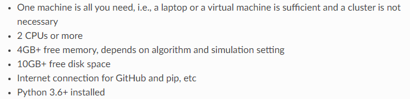

笔者建议大家尽量用python3.8以上的版本以及尽可能在带有GPU的服务器上安装Ianvs。如果你的实验室无法提供带有GPU的服务器，可以考虑租用一个GPU云服务器。在本案例中，笔者租用了一台云服务器用于安装Ianvs，其配置如下：

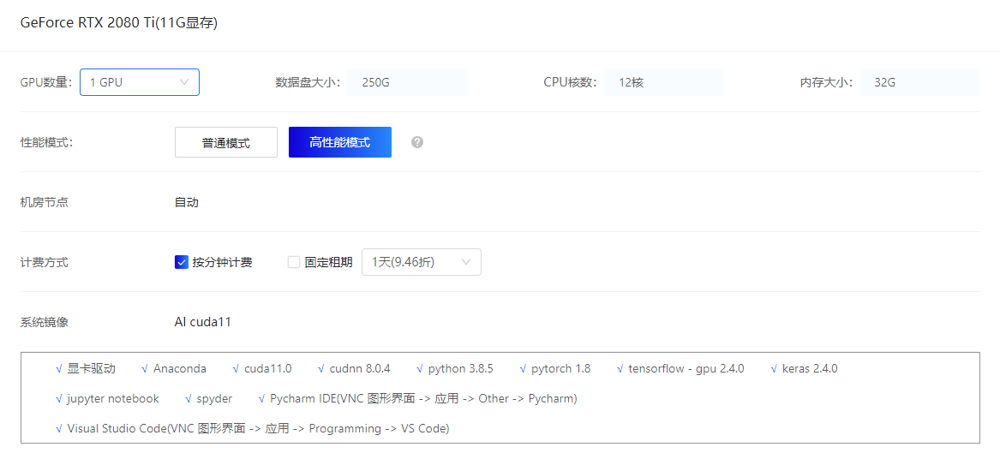

如果你是用自己实验室的服务器安装Ianvs，最好也确保提前安装好anaconda，pytorch等应用。

### 安装流程

首先创建Ianvs的文件夹，*注意如果你把Ianvs安装到别的位置，本教程中的部分路径配置也要一并修改*。

~~~bash
mkdir /ianvs
cd /ianvs #One might use another path preferred
mkdir project
cd project
~~~

然后从github上拉取Ianvs，由于笔者写本教程时终身学习分支还未合入主分支，所以现在先拉取feature-lifelong-n分支，未来终身学习分支合并后则可直接拉取主分支。

~~~bash
git clone https://github.com/kubeedge/ianvs.git
#git clone -b feature-lifelong-n https://github.com/kubeedge/ianvs.git
~~~

然后我们需要更新一些配置：

~~~bash
sudo apt-get update
sudo apt-get install libgl1-mesa-glx -y
python -m pip install --upgrade pip
~~~

然后安装Ianvs需要的一些第三方包，这里面主要是需要安装“/ianvs/project/ianvs/examples/resources/third_party/sedna-0.4.1-py3-none-any.whl”这个sedna的安装包，因为Ianvs终身学习需要用到sedna里面的算法。

~~~bash
cd /ianvs/project/ianvs
python -m pip install ./examples/resources/third_party/*
python -m pip install -r requirements.txt 
python setup.py install
~~~

**tip1**：安装过程可能会遇到以下报错，可以不用理会它，不会影响Ianvs运行。

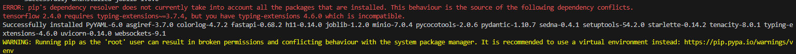

安装完成后输入命令：

~~~bash
ianvs -v
~~~

如果能正确显示ianvs版本如下：

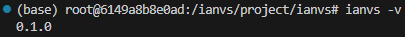

就说明你安装成功了。

**tip2**：如果显示报错缺少某某包的话，就用pip install命令安装缺少的包，笔者曾经遇到过缺少以下包的情况：

~~~bash
python -m pip install scikit-learn
python -m pip install tqdm
python -m pip install tensorboard
python -m pip install opencv-python
~~~

**tip3**：同时还有需要注意的是安装的pandas的版本不能太高，因为ianvs代码里面用到的pandas的部分功能在新版pandas中被移除了，运行时会报错pandas不存在np模块。如果你后面在运行时遇到这个报错，可以检查一下pandas的版本，安装低版本pandas：

~~~bash
pip install pandas==1.1.5
~~~

到此为止，我们就成功安装了Ianvs。

## Cloud-Robotics样例讲解与运行

在这章中我们通过运行Ianvs终身学习的cloud-robotics样例向大家讲解Ianvs终身学习的基本流程。

### Cloud-Robotics介绍

Cloud-Robotics数据集是Ianvs新发布的一个终身学习任务的语义分割数据集，关于数据集具体的介绍可以参考[benchmark网站](https://hsj576.github.io/)的内容。笔者也参与了该数据集的发布，所以在本教程中以该数据集为样例进行讲解。

### Quick Start

首先我们需要配置好Cloud-Robotics的数据集，先创建数据集的文件夹，*注意如果你把数据集放到别的位置，本教程中的部分路径配置也要一并修改*。

~~~bash
mkdir /data
cd /data
mkdir datasets
cd datasets
~~~

Cloud-Robotics数据集大小有7个G，目前是放在[kaggle](https://www.kaggle.com/datasets/hsj576/cloud-robotics)上，大家可以先下载到本机再上传到服务器上。但是这样会比较麻烦，所以笔者建议大家用kaggle API直接下载到服务器上，命令如下：

~~~bash
python -m pip install kaggle
kaggle datasets download -d hsj576/cloud-robotics
~~~

关于kaggle API的使用方法大家可以去网上搜一下教程，笔者在此就不再赘述了。

下载完成后解压数据集：

~~~bash
unzip cloud-robotics.zip
~~~

配置好数据集后，我们可以准备运行示例代码了。Cloud-Robotics示例运行的代码放在/ianvs/project/ianvs/examples/robot/lifelong_learning_bench/下，我们首先要配置python路径（这里如果Ianvs安装位置不一样的话需要更改路径）：

~~~bash
export PYTHONPATH=$PYTHONPATH:/ianvs/project/ianvs/examples/robot/lifelong_learning_bench/testalgorithms/rfnet/RFNet
~~~

然后我们检查一下yaml文件的信息：

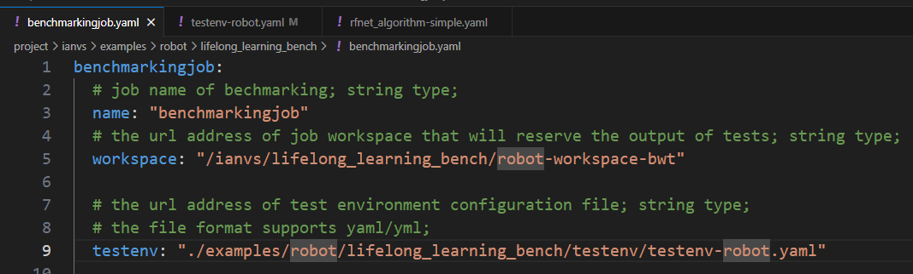

上图benchmarkjob.yaml中workplace是存放模型训练输出的路径，可以改成你需要的路径。

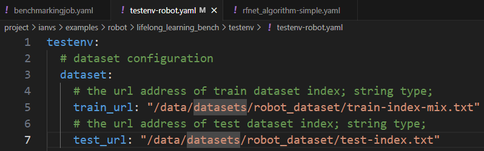

上图testenv-robot.yaml中train_url和test_url是数据集索引的路径，如果你的数据集存放位置和教程不一样，则需要修改train_url和test_url的路径。

其他的配置文件暂时没有需要调整的，具体配置文件的内容会在“配置文件讲解”小结中讲解。

接下来我们就可以运行示例代码了：

~~~bash
cd /ianvs/project/ianvs
ianvs -f examples/robot/lifelong_learning_bench/benchmarkingjob.yaml 
~~~

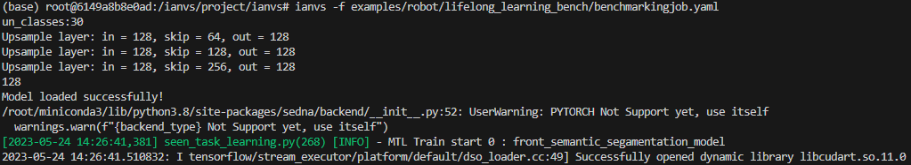

如果中间没有任何报错的话你应该在模型终身学习任务结束后看到以下内容：

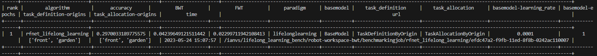

那么恭喜你，你已经跑通了一个Ianvs终身学习样例！

**tips4**：如果运行过程中pytorch dataloader卡死了（没有报错，但是程序卡死不动了），有可能是datalaoder多线程出现了死锁。这种情况下，建议将args.py中的self.workers数量调小：

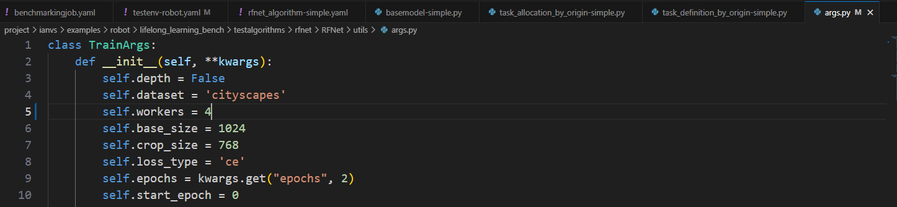

笔者在模型训练时曾多次出现该问题，尝试在代码中加了线程限制（如下）后仍然会时不时出现这种情况。

~~~python
os.environ["OMP_NUM_THREADS"] = "1" 
os.environ["MKL_NUM_THREADS"] = "1"
~~~

同时这个报错并不能稳定复现，并且笔者发现在incremental_rounds较大时更容易出现死锁情况。唯一可以彻底解决该问题的方式是在args.py中将self.workers设置为0，但这样会导致训练速度较慢。所以，在训练过程中如果遇到该问题，建议先把self.workers数量调小，如果还是出现该问题就把self.workers设置为0。

### 运行结果分析

在运行完该任务后，你可以在robot-workspace-bwt中查看该任务的信息。

~~~bash
/ianvs/lifelong_learning_bench/robot-workspace-bwt/
└── benchmarkingjob
    ├── rank
    │   ├── all_rank.csv
    │   └── selected_rank.csv
    └── rfnet_lifelong_learning
        └── efdc47a2-f9fb-11ed-8f8b-0242ac110007
            ├── dataset
            │   ├── model_eval-1.txt
            │   ├── model_eval-2.txt
            │   ├── model_eval-3.txt
            │   ├── model_eval-4.txt
            │   ├── model_eval-5.txt
            │   ├── model_train-1.txt
            │   ├── model_train-2.txt
            │   ├── model_train-3.txt
            │   ├── model_train-4.txt
            │   └── model_train-5.txt
            └── output
                ├── all-heatmap.png
                ├── eval
                ├── front_semantic_segamentation_model-heatmap.png
                ├── garden_semantic_segamentation_model-heatmap.png
                ├── result.pkl
                └── train
~~~

在rank中记录的是不同模型训练的结果：

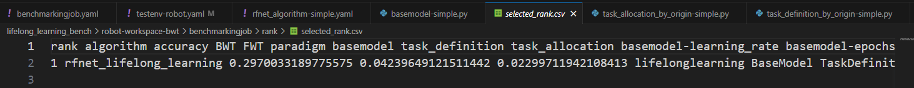

dataset中model_eval-1.txt是终身学习第一个incremental_round训练的验证集，model_train-1.txt是第一个incremental_round训练的训练集。为了测试模型的终身学习指标，比如BWT、FWT，模型在每个incremental_round训练完后都会在model_eval-1.txt到model_eval-5.txt中进行测试，所有测试的结果最后输出到了result.pkl中。

为了方便大家看出终身学习的效果，在all-heatmap.png中以热图的形式画出了各轮训练后在测试集上的结果：

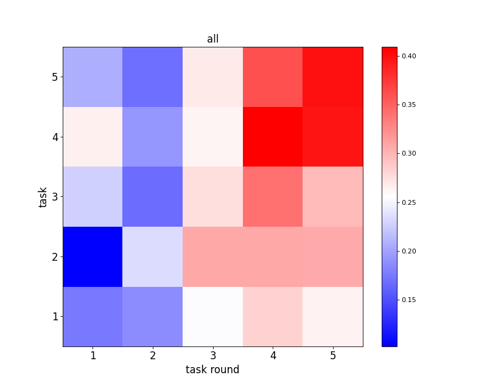

第【1（task round），3（task）】格代表模型在model_train-1.txt训练完后，在model_eval-3.txt上测试的结果。

在train文件夹中保存了模型训练过程的信息：

~~~bash
/ianvs/lifelong_learning_bench/robot-workspace-bwt/benchmarkingjob/rfnet_lifelong_learning/efdc47a2-f9fb-11ed-8f8b-0242ac110007/output/train/
├── 1
│   ├── index.pkl
│   ├── seen_task
│   │   ├── seen_task_task_attr_extractor.pkl
│   │   ├── train_front_semantic_segamentation_model.sample
│   │   └── train_garden_semantic_segamentation_model.sample
│   └── unseen_task
│       └── unseen_task_task_attr_extractor.pkl
├── 2
│   ├── index.pkl
│   ├── seen_task
│   │   ├── seen_task_task_attr_extractor.pkl
│   │   ├── train_front_semantic_segamentation_model.sample
│   │   └── train_garden_semantic_segamentation_model.sample
│   └── unseen_task
│       └── unseen_task_task_attr_extractor.pkl
├── 3
│   ├── index.pkl
│   ├── seen_task
│   │   ├── seen_task_task_attr_extractor.pkl
│   │   ├── train_front_semantic_segamentation_model.sample
│   │   └── train_garden_semantic_segamentation_model.sample
│   └── unseen_task
│       └── unseen_task_task_attr_extractor.pkl
├── 4
│   ├── index.pkl
│   ├── seen_task
│   │   ├── seen_task_task_attr_extractor.pkl
│   │   ├── train_front_semantic_segamentation_model.sample
│   │   └── train_garden_semantic_segamentation_model.sample
│   └── unseen_task
│       └── unseen_task_task_attr_extractor.pkl
└── 5
    ├── index.pkl
    ├── seen_task
    │   ├── front_semantic_segamentation_model.pth
    │   ├── garden_semantic_segamentation_model.pth
    │   ├── seen_task_task_attr_extractor.pkl
    │   ├── train_front_semantic_segamentation_model.sample
    │   └── train_garden_semantic_segamentation_model.sample
    └── unseen_task
        └── unseen_task_task_attr_extractor.pkl
~~~

front_semantic_segamentation_model和garden_semantic_segamentation_model分别是Cloud-Robotics终身学习中定义的两个任务模型。front_semantic_segamentation_model-heatmap.png和garden_semantic_segamentation_model-heatmap.png分别是这两个任务在各轮训练后在测试集上的结果。

在/ianvs/project/ianvs/train_loss.txt中记录了模型训练的loss，因为本次训练epoch是1、incremental_rounds是5，所以第13579行是front_semantic_segamentation_model的loss，第246810行是garden_semantic_segamentation_model的loss。

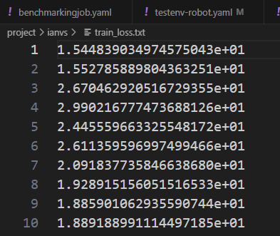

### 配置文件讲解

在本小节中将主要讲解该样例中各个配置文件的作用，以方便大家熟悉Ianvs终身学习的过程。

#### benchmark.yaml

这个文件是运行Ianvs必备的配置文件，里面主要是要填好testenv和testalgorithm的配置路径，其他没有啥好说的，注释里面写的比较详细。

#### testenv-robot.yaml

这个文件是测试环境的配置文件，里面比较重要的是填写数据集的路径，还有incremental_rounds。incremental_rounds代表的是终身学习进行几轮。

##### train-index-mix.txt和test-index.txt

这两个文件是终身学习的训练数据集与测试数据集，里面的内容如下：

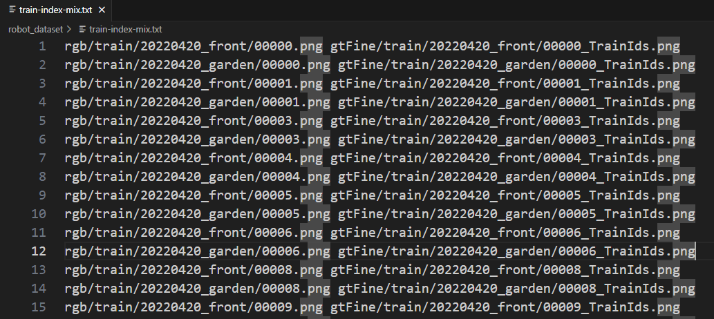

每行第一个是数据，第二个是其标签。Ianvs的数据集索引都需要写成这种形式，数据集中提供了index.py文件作为生成索引文件的样例。

文件夹中train-index-small.txt和test-index-small.txt中是数据集中十分之一的数据的索引文件，提供这两个索引文件目的是为了方便用户用小数据集先快速跑通模型。

#### rfnet_algorithm-simple.yaml

这个文件是测试算法的配置文件。lifelong_learning_data_setting中train_ratio代表的是验证集和训练集划分的比例。basemodel是进行语义分割的基模型，hyperparameters中可以调节模型训练的学习率和训练回合数。task_definition是终身学习的任务定义方法，task_allocation是终身学习的任务分配算法。此外还可以在配置文件中填写未知任务识别算法，不过在本样例中没有涉及。

## Ianvs终身学习关键代码解析